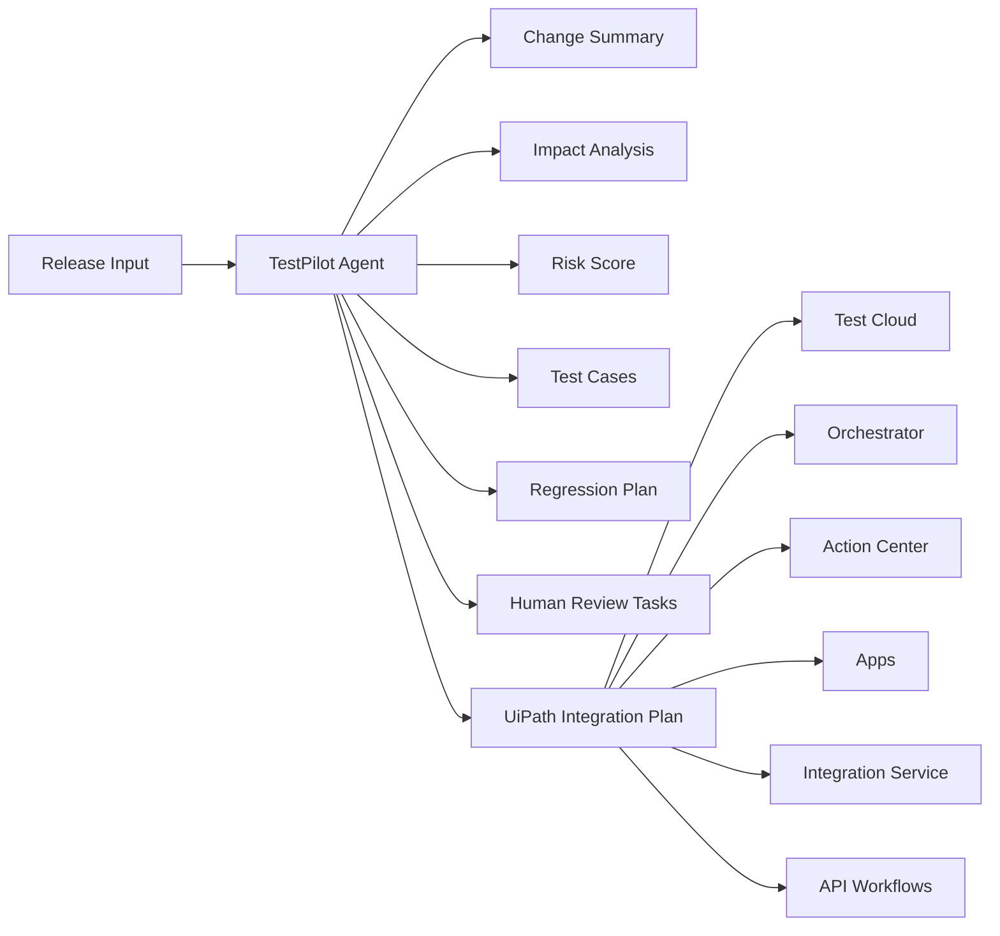

# TestPilot Agent

TestPilot Agent is an AI testing orchestration assistant for enterprise release teams. It converts a pull request, requirement, release note, or bugfix description into a structured testing plan: change summary, impacted modules, risk score, generated test cases, regression recommendations, human review tasks, and a UiPath integration plan.

Built for UiPath AgentHack Track 3, the project shows how UiPath Test Cloud can become the quality hub for AI-assisted release testing. The MVP runs in local mock mode by default, so it can be demoed without real UiPath tenant credentials.

## What It Does

TestPilot Agent helps teams answer release testing questions quickly:

- What changed in this release?
- Which business modules and user roles are affected?
- How risky is the change?
- What test cases should be created or updated?
- Which regression suites should run?
- What needs human review before release?
- How would this plan map to UiPath Test Cloud and the UiPath automation platform?

## Hackathon Fit

Track: UiPath AgentHack Track 3, UiPath Test Cloud.

TestPilot Agent is designed around Test Cloud as the destination for test cases, test sets, coverage, and quality planning. It also shows how the broader UiPath platform can support the release workflow:

- UiPath Test Cloud for generated test cases, test sets, and quality visibility.
- UiPath Orchestrator for queued automation and regression execution.
- UiPath Action Center for human review and approval tasks.
- UiPath Apps for a release testing cockpit.
- UiPath Integration Service for GitHub, Jira, ServiceNow, Slack, Teams, and other enterprise tools.
- UiPath API Workflows for reusable governed API actions across systems.

## MVP Scope

The MVP demonstrates the end-to-end workflow without depending on live UiPath APIs.

### Current MVP Transparency

By default, this submission runs as a local deterministic/mock agent pipeline. In default mode it does not call a hosted LLM provider, does not authenticate to a UiPath tenant, and does not create real UiPath Test Cloud, Orchestrator, or Action Center objects during the demo.

The generated outputs are structured locally to show the intended product behavior and the exact integration shape: test cases map to UiPath Test Cloud assets, automation candidates map to Orchestrator execution, and review tasks map to Action Center approvals. This keeps the hackathon demo reliable while making the production integration path explicit.

The backend also supports an optional OpenAI-compatible LLM mode. If a user provides their own API key through environment variables, TestPilot Agent can call a real model for analysis and fall back to the local mock pipeline when no key is present.

Included:

- Release input intake for PRs, requirements, release notes, and bugfixes.
- AI-style analysis for summary, impact, risk, and test planning.
- Optional OpenAI-compatible LLM analysis mode.
- Generated test cases and regression recommendations.
- Human review task recommendations.
- Mock UiPath integration plan.
- Demo-ready local flow.

Not included by default:

- Hosted LLM API calls unless explicitly enabled with a user-provided key.
- Production UiPath tenant authentication.
- Real Test Cloud object creation.
- Real Orchestrator job execution.
- Real Action Center task creation.
- Production connector setup.

## Architecture



See `docs/architecture.md` for the full architecture.

## Suggested Demo Input

```text
Title: Checkout payment timeout handling

PR Summary:
This PR updates the checkout payment retry logic. When the payment gateway
times out, the system now retries the authorization request up to two times
before marking the payment as failed. It also changes the error message shown
to the customer and updates order status handling so that pending payments are
not immediately cancelled.

Changed areas:
- Checkout payment flow
- Payment gateway adapter
- Order status update logic
- Customer-facing error message
```

## Expected Output

For a release input like the example above, TestPilot Agent should produce:

- Change summary explaining the payment timeout and retry behavior.
- Impacted modules such as checkout, payment gateway, order management, backend API, and frontend messaging.
- Critical risk score with rationale based on revenue-critical checkout impact.
- Test cases for smoke, functional, regression, integration, negative recovery, and approval-gate coverage.
- Regression recommendations for payment success, payment failure, duplicate charge prevention, and order status consistency.
- Human review tasks for QA Lead and Release Manager approval.
- UiPath plan for Test Cloud test case creation, Orchestrator execution, Action Center review, Apps cockpit display, Integration Service notifications, and API Workflow orchestration.

## Local Run

The app runs as a local monorepo with a FastAPI backend and Vite React frontend. The default mode is the local mock agent, so no UiPath tenant or LLM API key is required.

### One-command startup

```bash
chmod +x scripts/run-dev.sh
./scripts/run-dev.sh
```

Open `http://localhost:5173`.

### Optional LLM mode

The default mode is `mock`, which is free and stable. To use a real model, copy `.env.example` to `.env`, add your own API key, and switch the mode to `auto` or `llm`.

```bash
cp .env.example .env
```

Example:

```env
TESTPILOT_AGENT_MODE=auto
TESTPILOT_LLM_API_KEY=your_api_key_here
TESTPILOT_LLM_BASE_URL=https://api.openai.com/v1
TESTPILOT_LLM_MODEL=gpt-4o-mini
```

For DeepSeek or another OpenAI-compatible provider, change `TESTPILOT_LLM_BASE_URL` and `TESTPILOT_LLM_MODEL`. Keep real keys out of Git; `.env` is ignored.

Modes:

- `mock`: always use the local deterministic pipeline.
- `auto`: call the LLM when a key is configured, otherwise use mock.
- `llm`: try the LLM first, then fall back to mock unless `TESTPILOT_LLM_STRICT=true`.

### Manual startup

Backend:

```bash
cd backend
python3 -m venv .venv
.venv/bin/python -m pip install -r requirements.txt
.venv/bin/uvicorn app.main:app --reload --port 8000
```

Frontend:

```bash
cd frontend
npm install
npm run dev
```

Useful API endpoints:

- `GET http://localhost:8000/api/health`
- `GET http://localhost:8000/api/examples`
- `POST http://localhost:8000/api/analyze`
- `POST http://localhost:8000/api/export/markdown`
- `POST http://localhost:8000/api/export/json`

### Test and build

```bash
cd backend
.venv/bin/python -m pytest
```

```bash
cd frontend
npm run build
```

## Documentation

- `docs/architecture.md`: system design, component responsibilities, data flow, deployment modes, and governance.
- `docs/uipath-integration-plan.md`: detailed UiPath Test Cloud, Orchestrator, Action Center, Apps, Integration Service, and API Workflows mapping.
- `docs/demo-script.md`: 5-7 minute demo script, sample input, talk track, fallback path, and judge Q&A.
- `docs/codex-development-notes.md`: how Codex contributes as a coding agent and how to continue development safely.

## Why It Matters

Enterprise release testing often fails because change context, risk, test coverage, automation readiness, and human approval live in separate tools. TestPilot Agent brings those decisions into one structured flow and maps them to UiPath's testing and automation platform.

The result is faster planning, clearer risk ownership, better regression focus, and a practical path from release input to UiPath Test Cloud execution.

## Codex Development Note

Codex was used as a coding agent to accelerate architecture, documentation, planning, and verification workflows. This strengthens the hackathon story: TestPilot Agent applies agentic assistance to release testing, while Codex applies agentic assistance to software delivery.

## Future Work

- Connect to a UiPath sandbox tenant.
- Create draft test cases and test sets in Test Cloud.
- Queue safe regression automation through Orchestrator.
- Create review tasks in Action Center.
- Add source-system connectors through Integration Service.
- Wrap cross-system calls in API Workflows.
- Add role-based access, audit logs, and production-grade secret handling.
