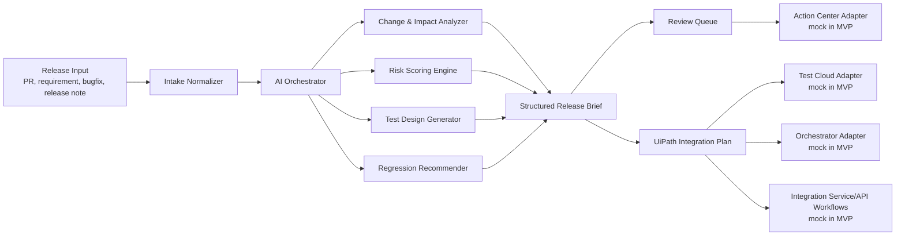

# Architecture

TestPilot Agent is an AI-assisted testing orchestration layer for enterprise release teams. It accepts a pull request, requirement, release note, or bugfix description and produces a release-aware testing plan: change summary, impacted modules, risk score, generated test cases, regression recommendations, human review tasks, and a UiPath integration plan.

The hackathon MVP runs in local mock mode by default. The architecture is intentionally shaped so the same orchestration flow can later call UiPath Test Cloud, Orchestrator, Action Center, Apps, Integration Service, and API Workflows through adapter interfaces.

## Product Boundary

TestPilot Agent is not a replacement for a test management system or a CI platform. It is a planning and coordination assistant that sits between engineering release inputs and UiPath-powered testing operations.

Primary responsibilities:

- Convert release inputs into structured testing intent.
- Identify likely affected domains, systems, and test suites.
- Score risk using change size, surface area, criticality, historical defects, and release context.
- Draft functional, regression, and exploratory test cases.
- Recommend automation candidates for UiPath Test Cloud.
- Create human review tasks for high-risk or ambiguous changes.
- Produce an integration-ready plan that enterprise teams can map to their UiPath estate.

Out of scope for the MVP:

- Direct production execution against a live UiPath tenant.
- Real credential storage for UiPath, Jira, GitHub, ServiceNow, or Slack.
- Full source-code semantic analysis beyond the data provided to the local agent.
- Autonomous release approval without human oversight.

## High-Level Flow



## Runtime Components

### Intake Normalizer

Transforms messy release input into a predictable internal payload. Example input types include GitHub pull request text, Jira stories, bugfix notes, release notes, and pasted manual requirements.

Expected normalized fields:

- `title`
- `sourceType`
- `changeSummary`
- `affectedAreas`
- `businessCriticality`
- `knownConstraints`
- `acceptanceCriteria`
- `links`

### AI Orchestrator

Coordinates the reasoning steps and keeps output consistent. It is responsible for calling analysis, scoring, test generation, regression recommendation, and UiPath plan generation in a deterministic order.

The MVP can run with mock or local LLM-style responses. Future production mode should keep the orchestrator provider-neutral so teams can route through approved enterprise AI services.

### Change & Impact Analyzer

Maps the release input to likely impacted modules and systems. In a full implementation, this component can combine repository metadata, dependency maps, prior incidents, service ownership, and test coverage data.

MVP output examples:

- Impacted business capability: checkout, invoice approval, employee onboarding.
- Impacted technical surface: UI screen, API endpoint, background workflow, integration connector.
- Impacted test assets: smoke, regression, API, end-to-end, data validation, role-based access tests.

### Risk Scoring Engine

Produces a risk score and explanation. The score should be explainable rather than purely opaque.

Recommended factors:

- Change type: feature, bugfix, refactor, configuration, dependency, data migration.
- Criticality: revenue, compliance, security, operational continuity.
- Blast radius: number of modules, roles, integrations, and workflows touched.
- Test confidence: existing coverage, prior flaky areas, missing acceptance criteria.
- Release timing: hotfix, normal release, major release, blackout-sensitive change.

Suggested scale:

- `0-30`: Low risk, standard automation and smoke coverage.
- `31-70`: Medium risk, targeted regression and reviewer sign-off.
- `71-100`: High risk, expanded regression, manual review, and explicit release approval.

### Test Design Generator

Creates actionable test cases from the change context. Test cases should include:

- Objective
- Preconditions
- Test data
- Steps
- Expected result
- Automation suitability
- Priority
- Suggested UiPath Test Cloud mapping

### Regression Recommender

Suggests regression suites based on impacted modules and risk. The output should distinguish:

- Required smoke tests
- Required targeted regression
- Recommended broader regression
- Optional exploratory checks
- Tests blocked by missing data, environment, or credentials

### Human Review Queue

Creates review tasks when automation alone is insufficient. In the MVP this is represented locally. In a UiPath implementation, these tasks map naturally to Action Center.

Common review triggers:

- Risk score above threshold.
- Ambiguous acceptance criteria.
- Customer-facing workflow changes.
- Compliance or audit-sensitive process changes.
- Test data requirements that cannot be generated safely.

### UiPath Adapters

Adapters isolate platform-specific behavior. The MVP can use mock implementations while preserving production-ready boundaries.

- Test Cloud adapter: maps generated cases to test cases, test sets, coverage, and execution recommendations.
- Orchestrator adapter: plans robot and job execution for automation workflows.
- Action Center adapter: creates human-in-the-loop review and approval tasks.
- Apps adapter: exposes a business-facing release testing cockpit.
- Integration Service adapter: connects to GitHub, Jira, ServiceNow, Slack, Microsoft Teams, and other enterprise systems.
- API Workflows adapter: wraps API calls and cross-system automation as reusable workflow units.

## Data Model

Recommended core objects:

```json
{
  "releaseInput": {
    "sourceType": "pull_request",
    "title": "Fix invoice approval routing for delegated managers",
    "body": "Release or PR text",
    "links": []
  },
  "analysisResult": {
    "changeSummary": [],
    "impactedModules": [],
    "riskScore": 0,
    "riskRationale": [],
    "testCases": [],
    "regressionPlan": [],
    "humanReviewTasks": [],
    "uipathIntegrationPlan": []
  }
}
```

## Deployment Modes

### Local Mock Mode

Default hackathon mode. No real UiPath tenant or credentials are required.

- Uses sample release inputs.
- Returns deterministic or locally generated analysis.
- Displays mock UiPath actions such as "Create Test Set", "Queue Orchestrator Job", and "Open Action Center Task".
- Demonstrates integration readiness without tenant setup risk.

### Connected Sandbox Mode

Optional post-MVP mode for teams with UiPath sandbox access.

- Uses OAuth or tenant-approved credentials.
- Creates test case drafts in Test Cloud.
- Queues test automation jobs through Orchestrator.
- Creates human tasks in Action Center.
- Connects source systems through Integration Service.

### Enterprise Mode

Future production pattern.

- Runs inside enterprise identity and network boundaries.
- Stores credentials only in approved secret managers.
- Enforces role-based permissions.
- Audits every AI-generated recommendation and human approval.
- Supports policy-based release gates.

## Security and Governance

Enterprise release data may include customer, security, compliance, or proprietary code details. Production deployments should enforce:

- Tenant-approved authentication and authorization.
- No hardcoded credentials.
- Secrets stored in an approved vault.
- Data minimization before LLM calls.
- Audit logs for generated test plans and approvals.
- Human approval for high-risk release decisions.
- Clear labeling of AI-generated recommendations.

## Failure Handling

The orchestration flow should degrade gracefully:

- If source input is incomplete, request missing acceptance criteria.
- If risk cannot be scored confidently, increase the review requirement.
- If UiPath APIs are unavailable, preserve the generated plan and queue retryable actions.
- If test generation is ambiguous, create exploratory review tasks instead of inventing certainty.

## Why This Architecture Fits UiPath AgentHack Track 3

UiPath Test Cloud is the natural destination for generated and recommended tests. Orchestrator is the execution control plane for automated test workflows. Action Center provides human-in-the-loop review for release risks that should not be handled autonomously. Apps can become the business-facing testing cockpit. Integration Service and API Workflows connect the assistant to the broader enterprise release toolchain.

The MVP proves the workflow locally while keeping integration points explicit, reviewable, and realistic for an enterprise UiPath deployment.
