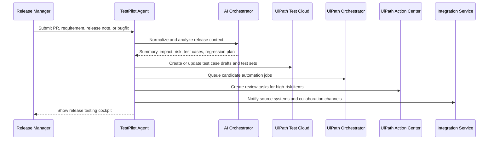

# UiPath Integration Plan

This document explains how TestPilot Agent maps to UiPath Test Cloud and the surrounding UiPath platform. The MVP does not require live UiPath API access; it uses a local deterministic/mock agent pipeline and local mock adapters that model the platform actions clearly enough for a hackathon demo and future implementation.

## Current MVP Transparency

The hackathon MVP does not call a hosted LLM provider and does not authenticate to a UiPath tenant. It also does not create real Test Cloud test cases, queue real Orchestrator jobs, or create real Action Center tasks during the demo.

Instead, the app produces structured local outputs that are shaped like the intended production integration. This makes the demo repeatable for judges while showing exactly where real UiPath Test Cloud, Orchestrator, Action Center, Integration Service, and API Workflow calls would be connected next.

## Integration Goals

TestPilot Agent should help release teams move from "what changed?" to "what should we test, who should review it, and how should UiPath execute it?"

The integration plan has five goals:

- Turn release input into UiPath-ready testing assets.
- Recommend the right automated, manual, and exploratory test coverage.
- Use human review for high-risk changes.
- Preserve a clear audit trail from release input to test plan.
- Keep the MVP runnable without production credentials.

## UiPath Platform Roles

### UiPath Test Cloud

Test Cloud is the primary target for test design and quality visibility.

Planned responsibilities:

- Create or update test case drafts from AI-generated test scenarios.
- Group cases into test sets based on release risk and impacted modules.
- Map generated tests to requirements, stories, or pull requests.
- Track coverage gaps and recommended regression scope.
- Provide execution and quality reporting once test runs are connected.

MVP representation:

- The app displays "Test Cloud Plan" records locally.
- Each generated test case includes suggested priority, automation suitability, and target suite.
- Mock actions show what would be created in Test Cloud.

### UiPath Orchestrator

Orchestrator is the automation execution and operations control plane.

Planned responsibilities:

- Trigger unattended or attended robot jobs for automated regression.
- Select folders, processes, robots, assets, and queues.
- Pass release-specific parameters into automation workflows.
- Collect job status and execution outcomes.
- Support retry and scheduling policies for test execution.

MVP representation:

- The app generates an execution plan with candidate process names and job parameters.
- Mock status values show queued, running, passed, failed, or needs review.
- No real robot execution is required.

### UiPath Action Center

Action Center is the human-in-the-loop review surface.

Planned responsibilities:

- Create review tasks for high-risk or ambiguous releases.
- Ask SMEs to confirm acceptance criteria, test data, or business impact.
- Require explicit sign-off before risky automation execution or release approval.
- Capture reviewer decisions for auditability.

MVP representation:

- The app creates local "Human Review Task" entries.
- Tasks include owner role, reason, due timing, and recommended decision.
- Demo flow can show a reviewer approving, rejecting, or requesting clarification.

### UiPath Apps

Apps can provide a business-facing interface for release testing orchestration.

Planned responsibilities:

- Let release managers submit PRs, release notes, or bugfix descriptions.
- Show risk score, impacted modules, and recommended test plan.
- Expose reviewer tasks and automation status in one cockpit.
- Provide a lightweight interface for non-developer stakeholders.

MVP representation:

- The frontend can be positioned as the prototype of a future UiPath Apps experience.
- The UI should emphasize business clarity: impact, risk, tests, review actions, and integration plan.

### UiPath Integration Service

Integration Service connects TestPilot Agent to enterprise systems.

Planned responsibilities:

- Pull release context from GitHub, GitLab, Azure DevOps, Jira, ServiceNow, Slack, Microsoft Teams, or other systems.
- Push notifications and summaries to collaboration tools.
- Synchronize issue links, release IDs, and reviewer decisions.
- Reduce custom connector code by using managed UiPath connectors where available.

MVP representation:

- Source system events are simulated with local sample inputs.
- Output includes connector recommendations such as "GitHub PR intake", "Jira story enrichment", or "Teams release notification".

### UiPath API Workflows

API Workflows can wrap cross-system operations as reusable workflow blocks.

Planned responsibilities:

- Encapsulate calls to Test Cloud, Orchestrator, Action Center, and external tools.
- Standardize authentication, retries, error handling, and audit logging.
- Provide reusable workflow actions such as:
  - `CreateReleaseTestPlan`
  - `CreateActionCenterReviewTask`
  - `QueueRegressionExecution`
  - `NotifyReleaseChannel`
  - `SyncTestResultToTicket`

MVP representation:

- The app lists recommended API Workflow steps without executing them.
- Mock adapters return predictable responses for demo reliability.

## Proposed Integration Flow



In the MVP, calls to Test Cloud, Orchestrator, Action Center, and Integration Service are local mock calls. The sequence remains the same so the demo can explain the real enterprise path.

## Data Mapping

| TestPilot Output | UiPath Target | Notes |
| --- | --- | --- |
| Change summary | Test Cloud requirement or annotation | Links release input to test design context. |
| Impacted modules | Test Cloud labels, folders, or custom fields | Supports filtering and suite selection. |
| Risk score | Test set priority or release gate metadata | Drives automation depth and review requirement. |
| Generated test cases | Test Cloud test cases | Includes preconditions, steps, expected results, and data needs. |
| Regression recommendations | Test Cloud test sets | Groups required and recommended coverage. |
| Automation candidates | Orchestrator processes/jobs | Uses process names and release parameters. |
| Human review tasks | Action Center tasks | Handles ambiguity, compliance, and high-risk approval. |
| Notifications | Integration Service connectors | Sends summary to Jira, GitHub, Teams, Slack, or ServiceNow. |
| Cross-system operations | API Workflows | Wraps API calls into reusable governed workflows. |

## MVP Mock Contract

The mock layer should behave like the real integration boundary without requiring credentials.

Recommended mock methods:

```text
createTestCaseDraft(testCase)
createTestSet(regressionPlan)
queueAutomationRun(executionPlan)
createReviewTask(reviewTask)
sendReleaseNotification(summary)
buildApiWorkflowPlan(integrationPlan)
```

Each method should return:

- `mockId`
- `status`
- `displayName`
- `nextAction`
- `platformTarget`

Example mock response:

```json
{
  "mockId": "tc-case-001",
  "status": "planned",
  "displayName": "Validate delegated manager invoice approval",
  "nextAction": "Create draft test case in UiPath Test Cloud",
  "platformTarget": "UiPath Test Cloud"
}
```

## Implementation Phases

### Phase 1: Hackathon MVP

- Local sample inputs.
- Local AI orchestration or mock agent.
- Mock UiPath adapters.
- UI showing analysis, risk, test plan, review tasks, and integration plan.
- Clear demo script showing where each UiPath product fits.

### Phase 2: Sandbox Integration

- Connect to a UiPath sandbox tenant.
- Implement authentication through approved tenant credentials.
- Create draft test cases and test sets in Test Cloud.
- Queue safe demonstration jobs through Orchestrator.
- Create test review tasks in Action Center.

### Phase 3: Enterprise Pilot

- Connect GitHub, Jira, ServiceNow, Teams, or Slack through Integration Service.
- Add role-based access and audit logging.
- Add policy thresholds for release gates.
- Add environment and test data governance.
- Integrate test execution results back into release tickets.

### Phase 4: Production Hardening

- Add observability, retries, and failure queues.
- Add tenant-specific configuration.
- Add model governance and prompt/version audit.
- Add security review for data handling.
- Add release approval workflows and compliance exports.

## Authentication and Secrets

The MVP should not include real secrets.

Production guidance:

- Use tenant-approved OAuth or service app credentials.
- Store secrets in a vault or UiPath assets where appropriate.
- Never commit credentials to source control.
- Scope permissions to the minimum required operations.
- Separate development, sandbox, and production tenants.

## Error Handling

Recommended behavior:

- If Test Cloud creation fails, preserve the generated test plan and mark it retryable.
- If Orchestrator queueing fails, keep manual test recommendations visible.
- If Action Center is unavailable, show local review tasks and exportable task details.
- If Integration Service connector calls fail, display notification status without blocking test planning.
- If API Workflow execution fails, record the failed step and suggested remediation.

## Hackathon Judging Narrative

TestPilot Agent demonstrates the value of UiPath Test Cloud by turning ambiguous release input into structured, risk-based testing work. The project shows how Test Cloud can become the quality hub, Orchestrator can execute the recommended automation, Action Center can keep humans in the loop, Apps can expose the release cockpit, Integration Service can connect enterprise tools, and API Workflows can govern cross-system actions.

The local mock approach keeps the demo reliable while making the production integration path concrete.
